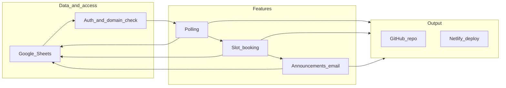

# AI Agent Overview Document for Teacher-Student Education App

## Purpose

Create one project document that an AI agent (or human) will use as the single source of truth when implementing the app. The document will be committed to the repo and will drive: architecture, implementation order, and what must be produced for GitHub and Netlify.

## Deliverable

Single file: `AGENTS.md` at the project root (or `docs/AGENT_OVERVIEW.md` if a docs folder is preferred). No code changes; this is a one-file addition.

---

## 1. Agent role and goal

- **Role:** Sole developer for a frontend-only education web app; owner of architecture, implementation, and deployment. No custom backend; persistence and server-side behavior via Google Sheets (and optionally Google Apps Script for email/SMS).
- **Goal:** Ship a working web app with three features:
  1. office-hours polls with top-two config suggestions one week after close,
  2. slot-based booking after office hours are set,
  3. teacher announcements emailed to all students in a class.
- **Success criteria:** A reader can clone, set env vars and Google credentials, deploy to Netlify, and use all three features with school-email auth and Google Sheets as the only data store.

## 2. Explicit constraints (locked in)

- **Auth:** School email only; allowed domains `@mta.ca` and `@umoncton.ca`. Reject all others.
- **Scope:** Multiple teachers; single pool of students with differing course memberships (multi-tenant by class, not by school).
- **Stack:** Frontend only + Google Sheets. No long-running backend server; optional Apps Script or Netlify Functions for email/API proxy.
- **Booking:** Students pick a specific slot (not a single queue).
- **Announcements:** Delivered by email; notification layer must be modular so SMS (or other channels) can be added later without changing feature code.

## 3. Chain of thought (reasoning order)

Eight ordered steps the agent must follow when planning and implementing:

1. **Data model (Sheets as schema)**  
   Enumerate entities (`User`, `Class`, `Poll`, `PollResponse`, `OfficeHoursConfig`, `Slot`, `Booking`, `Announcement`, `Roster`). Map to workbook(s) and sheet layouts. Decide multi-tenancy (shared workbook with teacher/class IDs; roster = `Class + StudentEmail`).

2. **Authentication and authorization**  
   Frontend-only auth; domain check for `@mta.ca` and `@umoncton.ca`; role (teacher/student) from Sheets or convention; gate every Sheets read/write on auth + domain + class permission.

3. **Google Sheets access**  
   Choose and document one of:
   - Sheets API from browser (key + sharing),
   - Apps Script Web App (`doGet`/`doPost` + CORS),
   - Netlify Function proxy.  
   Document deployment and CORS if Apps Script is used.

4. **Feature 1: Office-hours polling**  
   Teacher creates poll (hours, slot length, days/week) per class; students submit responses to Sheets; poll closes (7 days or teacher-set); compute top two configurations; write results and email teacher; use a notification abstraction for future SMS.

5. **Feature 2: Booking (pick a slot)**  
   Derive slots from office-hours config; store in Sheets; students book one slot; enforce one booking per student per slot and no overbooking.

6. **Feature 3: Announcements and email**  
   Teacher posts announcement per class; store in Sheets; notification module emails all students in class roster; single interface (for example `sendAnnouncement(recipients, subject, body)`) with email implementation now and SMS pluggable later.

7. **Deployment and repo**  
   Netlify-oriented structure (static build, optional `netlify/functions/`); README with clone, install, env, run, build, deploy; no secrets in repo.

8. **Edge cases**  
   Duplicate poll responses (overwrite or reject); double-booking prevention; batching/rate-limit for announcement emails; reject non-school emails at login or first access.

## 4. Constrained output (what the agent must produce)

- **Repo layout:** Root `README.md`, `package.json`, build config, `.env.example` (or env docs in README); no backend except serverless; source in `src/` (components, pages, services, hooks); one way to run locally and one to build for production.
- **README contents:** One-sentence description; prerequisites (Node, Google/Sheets, Netlify); clone, install, env, run, build, deploy; how to create/link Sheet(s) and deploy Apps Script if used; note auth is restricted to `@mta.ca` and `@umoncton.ca`.
- **Code rules:** No long-running server; auth only for allowed domains; one notification abstraction (email now, SMS-ready); booking = one concrete slot per student.
- **Required artifacts (in code or README):** Sheet layout (workbook, sheet names, column headers for all entities); definition of "top two configurations" and where it is implemented; where "one week later" is enforced (poll end date + script/cron that writes results and sends email).
- **Deployment:** `npm run build` (or equivalent) must succeed; Netlify steps documented; no hardcoded production URLs or secrets; config via env.

## 5. One-paragraph project summary

Multi-tenant, frontend-only education app for multiple teachers and a single pool of students with different course memberships. Auth is school email only (`@mta.ca`, `@umoncton.ca`). Data is Google Sheets only; no custom backend. Three features: (1) office-hours polls where teachers define options and students respond, and one week after poll close the teacher gets top two configurations; (2) booking where students pick a specific slot after office hours are set; (3) announcements where teachers post to a class and all students in that class receive email. Deliverables are a GitHub-ready repo (with README and env docs) and Netlify deployment. Booking is slot-based, there is no long-running server, and notifications are abstracted for email now with future SMS support.

---

## Optional: Mermaid diagram for agent flow

## Outcome

After plan approval, the only implementation step is to create this single overview file (`AGENTS.md`) with the sections above. No application code, no dependency changes; this document is the source of truth the AI agent uses while writing code and preparing the repo for GitHub and Netlify.
